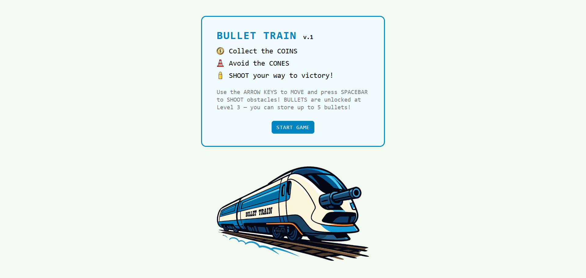
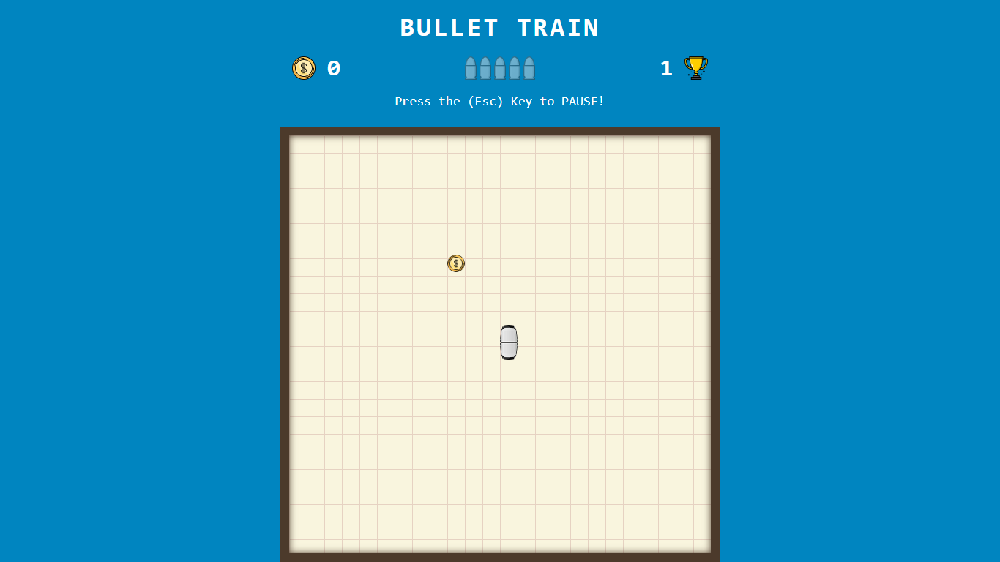

# 🚂 Bullet Train

**Bullet Train** is a simple and exciting game inspired by the classic Nokia Snake, but with a twist — you control a moving train!

## 🎯 Features

- Smooth and continuous movement of the train
- Collect coins to increase your score
- Random obstacles appear — avoid crashing into them!
- The train grows longer by adding a wagon after each level-up
- Starting from Level 3, you can shoot bullets to destroy obstacles
- Maximum bullet storage is limited to 5 bullets
- Pause and resume the game with the `Escape (Esc)` key

## 🕹️ How to Play

- The train moves automatically across the game board.
- Use the arrow keys to change the train’s direction.
- Collect coins to earn points and grow your train.
- Avoid crashing into obstacles — hitting one ends the game.
- From Level 3 onwards:
  - You receive **one bullet per level**.
  - You can shoot bullets (Press the **Spacebar**) to destroy obstacles.
  - **You can store up to 5 bullets maximum**. Collecting beyond 5 bullets will have no effect until you use some.
- Press `Esc` at any time to **pause** or **resume** the game.

#

## 🎮 Controls

| Action              | Key          |
| ------------------- | ------------ |
| Move Up             | Arrow Up     |
| Move Down           | Arrow Down   |
| Move Left           | Arrow Left   |
| Move Right          | Arrow Right  |
| Shoot Bullet        | Spacebar     |
| Pause / Resume Game | Escape (Esc) |

## 🚀 Getting Started

You can play the game online here:

👉 [Play BULLET TRAIN](https://iampedi.github.io/OOP-Game/)
